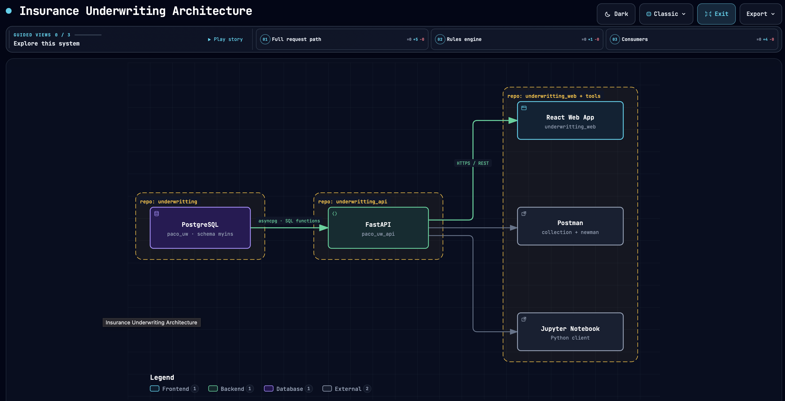

# 🔌 Insurance Underwriting API

A FastAPI service that exposes the [`underwritting`](../underwritting) rules engine over
HTTP, so a frontend or any other client can drive a full insurance quote: pick a product,
answer its questions, and receive an underwriting decision.

## 🎯 Purpose

The rules engine already knows how to evaluate a quote — every underwriting decision is
computed by PostgreSQL functions in that project. This API doesn't reimplement any of that
logic; it simply gives web, mobile, or script-based clients a clean, well-documented HTTP
contract for reaching it.

## 💡 What it does

- Lists available insurance products and their underwriting questions
- Creates a quote and collects an applicant's answers
- Evaluates a quote under either of two decision strategies and returns the outcome
- Keeps a full audit history of every evaluation, for traceability
- Offers an admin surface to build out the product catalog itself — new products,
  questions, and rules — without touching the database directly

## 🚀 Deployment

Live at **[underwriting-api-4ky9.onrender.com](https://underwriting-api-4ky9.onrender.com)**
(Render), backed by a PostgreSQL database on Neon, and consumed by the companion frontend
at **[paco-uw-web.vercel.app](https://paco-uw-web.vercel.app)** (Vercel). `GET /health` is
the quickest way to confirm the service is up.

## 🏗️ Architecture

  

  <a href="diagrams/underwriting-architecture.html">View the full architecture diagram interactively</a>

The API is intentionally a thin layer: it translates HTTP requests into calls against the
rules engine and shapes the responses, but the underwriting decision itself always comes
from the database.

## 🧠 Engineering Highlights

- Thin HTTP layer over a data-driven rules engine — no business logic duplicated here
- Per-quote access tokens so applicants can only reach their own quote
- Rate limiting and structured abuse logging on every write endpoint
- Locked-down CORS policy, scoped to the deployed frontend only
- Request size limits to guard against oversized payloads
- Consistent, predictable error responses across the whole API
- Automated dependency vulnerability scanning
- Interactive, auto-generated API documentation

## 🧪 Testing

A pytest contract and integration suite runs against a real, freshly rebuilt PostgreSQL
database — no mocking — covering products, quotes, evaluation, CORS, rate limiting, and
the admin endpoints. The API is also exercised through a ready-made Postman collection and
a Jupyter notebook client, both driving the same workflows a real frontend would.

## 🛠️ Technology

Python · FastAPI · asyncpg · PostgreSQL (Neon) · Render · Vercel · pytest · Postman

## 📚 Further Reading

For endpoint-by-endpoint behavior, security internals, local setup, and the full test/CI
story, see the [Technical Reference](docs/TECHNICAL.md).
